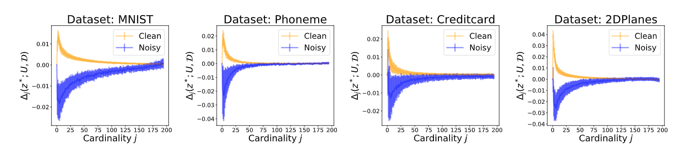
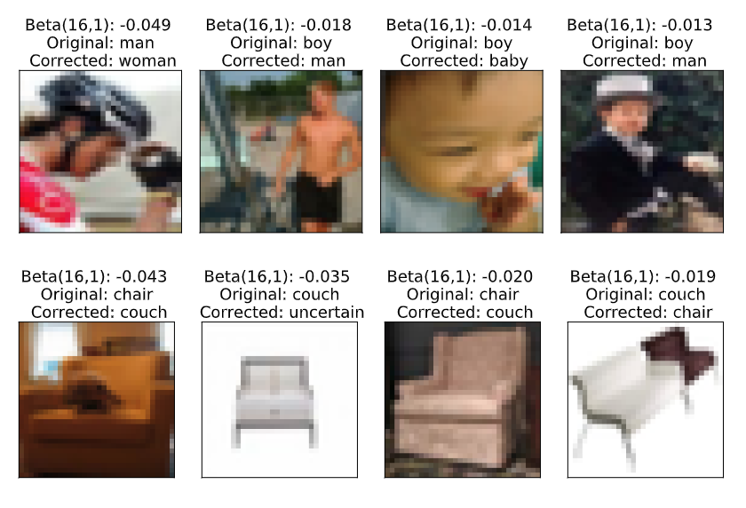

## Beta Shapley: a Unified and Noise-reduced Data Valuation Framework for Machine Learning

This repository provides an implementation of the paper [Beta Shapley: a Unified and Noise-reduced Data Valuation Framework for Machine Learning](https://arxiv.org/abs/2110.14049) accepted at [AISTATS 2022](https://aistats.org/aistats2022) as oral presentation. We propose a noise-reduced data valuation method, Beta Shapley, which is **powerful at capturing the importance of data points**.

## Quick start

We provide a [notebook](notebook/Example_Covertype_dataset.ipynb) using the [Covertype dataset](https://scikit-learn.org/stable/modules/generated/sklearn.datasets.fetch_covtype.html). It shows how to compute the Beta Shapley value and its application on several downstream ML tasks.

--> Beta Shapley can identify noisy samples by focusing marginal contributions on small cardinalities.

--> Beta Shapley on the CIFAR100 test dataset. Mislabeled data points have negative Beta Shapley values, meaning they actually harm the model performance. Beta Shapley can detect mislabeled points.

## Files

`betashap/ShapEngine.py`: main class for computing Beta-Shapley.

`betashap/data.py`: handles loading and preprocessing datasets.

